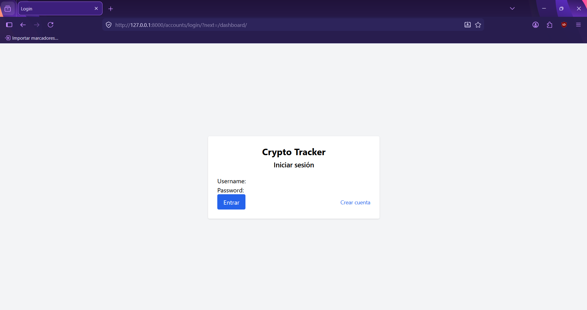
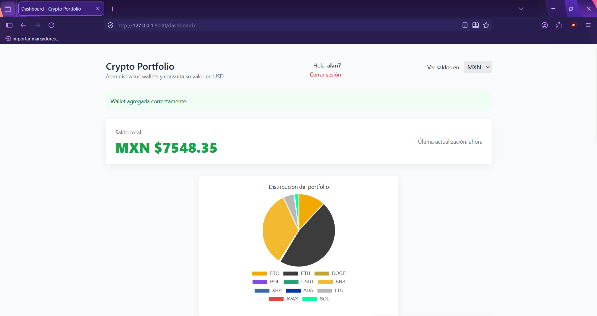
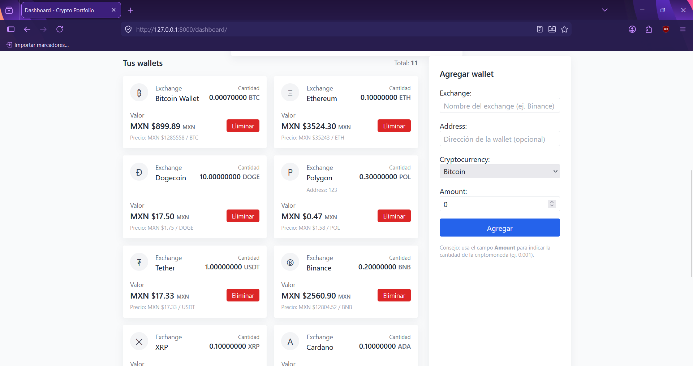
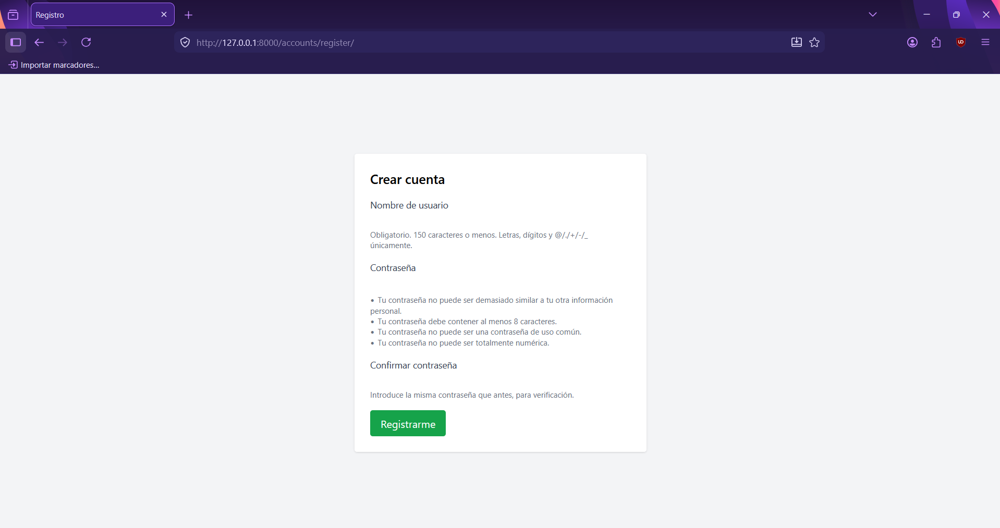

<h1>Crypto Portfolio Tracker</h1>

Aplicación web para gestionar y visualizar carteras de criptomonedas. Permite registrar wallets (exchange o direcciones on‑chain), consultar precios en tiempo real desde <strong>CoinGecko</strong>, calcular balances en distintas divisas (USD, MXN, EUR) y visualizar la distribución de la cartera con gráficos interactivos.

<h2>Tecnologías usadas</h2>
<ul>
<li><strong>Backend:</strong> Django</li>
<li><strong>API de precios:</strong> CoinGecko (endpoints públicos)</li>
<li><strong>Frontend:</strong> Tailwind CSS, Font Awesome</li>
<li><strong>Gráficos:</strong> Chart.js</li>
<li><strong>Base de datos:</strong> SQLite (desarrollo); compatible con PostgreSQL/MySQL en producción</li>
<li><strong>Cache:</strong> Django cache framework (LocMemCache en desarrollo; Redis/Memcached recomendado en producción)</li>
<li><strong>Despliegue:</strong> WSGI (PythonAnywhere) o cualquier proveedor que soporte WSGI/ASGI</li>
<li><strong>Autenticación:</strong> Django Auth (registro, login, logout)</li>
</ul>

<h2>Instalación local</h2>

<h3>Requisitos</h3>
<ul>
  <li>Python 3.10+</li>
  <li>Git</li>
</ul>

<h3>Pasos</h3>
<ol>
  <li>
    <strong>Clonar el repositorio</strong>
    <pre><code>git clone https://github.com/tuusuario/crypto-portfolio-tracker.git
cd crypto-portfolio-tracker</code></pre>
  </li>

  <li>
    <strong>Crear y activar entorno virtual</strong>
    <pre><code>python -m venv venv
# Linux / macOS
source venv/bin/activate
# Windows (PowerShell)
venv\Scripts\Activate.ps1</code></pre>
  </li>

  <li>
    <strong>Instalar dependencias</strong>
    <pre><code>pip install -r requirements.txt</code></pre>
  </li>

  <li>
    <strong>Aplicar migraciones y crear superusuario</strong>
    <pre><code>python manage.py migrate
python manage.py createsuperuser</code></pre>
  </li>

  <li>
    <strong>Ejecutar servidor de desarrollo</strong>
    <pre><code>python manage.py runserver</code></pre>
    
Abrir en el navegador: <code>http://127.0.0.1:8000/dashboard/</code>

  </li>
</ol>
<h2>Capturas de pantalla</h2>

